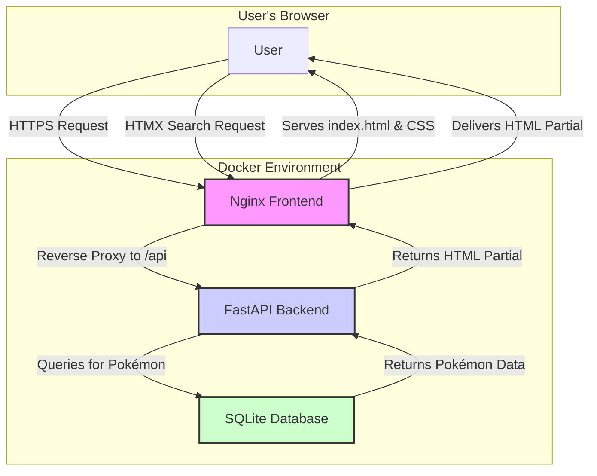
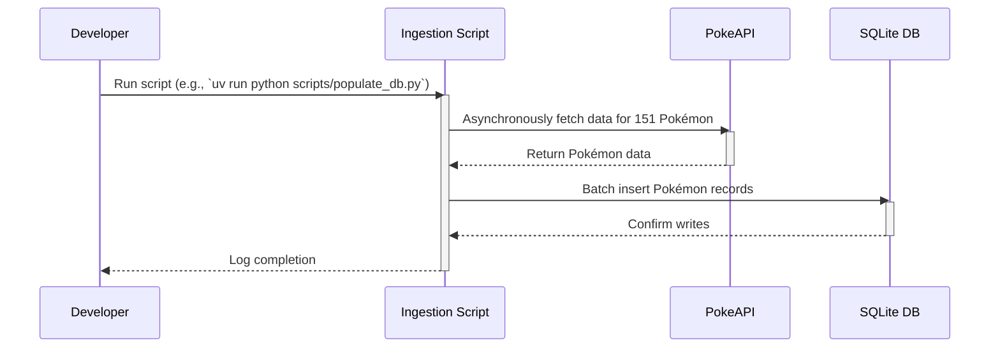

# Pokedex Application - System Architecture

**Version:** 1.0
**Date:** 2025-09-01
**Author:** Winston, Architect

---

### 1. Introduction

This document outlines the system architecture for the Pokedex application, a project designed to serve as a tangible case study for the BMAD (Build-Measure-Adapt-Document) development method. It provides a comprehensive blueprint for developers, covering the high-level design, technology stack, API specifications, and operational considerations.

The primary goal of this architecture is to fulfill the requirements outlined in the [Product Requirements Document (PRD)](./prd.md) while adhering to the principles of simplicity, maintainability, and rapid development.

### 2. High-Level Architecture

The application will follow a classic **three-tier architecture**, containerized for portability and ease of deployment. This model provides a clear separation of concerns between presentation, application logic, and data storage.

#### 2.1. System Components

1.  **Frontend (Presentation Tier):** A static web interface built with HTML, Tailwind CSS, and HTMX. It will be served by an Nginx web server.
2.  **Backend (Application Tier):** A Python-based API built with FastAPI. This service will handle business logic, data processing, and communication with the database.
3.  **Database (Data Tier):** A simple SQLite database to store Pokémon data.

#### 2.2. Architecture Diagram



#### 2.3. Data Ingestion Flow

A one-time data ingestion script will populate the SQLite database from the public PokeAPI. This script is run manually once during setup or can be integrated into the container build process if needed.



### 3. Technology Stack

The technology stack is chosen to align with the PRD's constraints (**NFR5**, **NFR6**), emphasizing modern, high-performance, open-source tools.

| Category      | Technology / Tool | Version | Rationale                                                              |
| :------------ | :---------------- | :------ | :--------------------------------------------------------------------- |
| **Backend**   | Python            | 3.13    | Modern, widely-supported language.                                     |
|               | FastAPI           | Latest  | High-performance async web framework with excellent developer tooling. |
|               | Pydantic          | Latest  | Core to FastAPI for robust data validation and serialization.          |
|               | SQLAlchemy        | Latest  | Used in the ingestion script for reliable database interaction.        |
| **Frontend**  | HTML5             | -       | Standard for web content.                                              |
|               | HTMX              | Latest  | Enables modern, dynamic UIs directly from the backend without heavy JS. |
|               | Tailwind CSS      | Latest  | Utility-first CSS framework for rapid, responsive UI development.      |
| **Database**  | SQLite            | 3.x     | Zero-configuration, file-based database ideal for a self-contained app. |
| **DevOps**    | Docker            | Latest  | Containerization for consistent development and deployment.            |
|               | Docker Compose    | Latest  | Orchestrates multi-container application startup.                      |
|               | GitHub Actions    | -       | CI/CD automation for quality assurance.                                |
| **Tooling**   | `uv`              | Latest  | High-performance Python package and environment manager.               |
|               | `ruff`            | Latest  | All-in-one linter and formatter for clean, consistent Python code.     |
|               | `pytest`          | Latest  | Standard framework for testing Python code.                            |
|               | `mypy`            | Latest  | Static type checker to enforce type hints and prevent bugs.            |

### 4. Coding Standards

To ensure code quality, maintainability, and consistency, all Python code contributed to the backend must adhere to the following standards:

*   **PEP 8 Compliance:** All code will be formatted according to the PEP 8 style guide. This will be enforced automatically by the `ruff` formatter.
*   **Type Hinting:** All functions and methods must include type hints for arguments and return values. This will be enforced by `mypy`.
*   **Linting:** Code will be checked against a strict set of linting rules defined in `pyproject.toml` and enforced by `ruff`.

These checks will be run automatically as part of the CI/CD pipeline.

### 5. CI/CD Pipeline

Two separate CI/CD pipelines will be established using GitHub Actions to ensure the quality of the backend and frontend codebases independently.

#### 5.1. Backend CI Pipeline (`.github/workflows/ci.yaml`)

This workflow runs on every pull request targeting the `master` branch.

*   **Trigger:** `on: [pull_request]`
*   **Jobs:**
    1.  **`lint-and-test`**:
        *   **Setup:** Checks out the code and sets up Python 3.13.
        *   **`uv` Installation:** Uses the official `astral-sh/setup-uv@v1` action for fast and reliable setup. Caching is enabled.
        *   **Linting:** Runs `ruff format --check .` and `ruff check .` to enforce code style and quality.
        *   **Type Checking:** Runs `mypy .` to validate type hints.
        *   **Testing:** Runs `pytest` to execute all unit and integration tests.
    2.  **`smoke-test`**:
        *   **Needs:** `lint-and-test`
        *   **Description:** Runs after tests pass to ensure the containerized application starts and responds correctly.
        *   **Steps:**
            *   Builds and starts the services using `docker compose up -d`.
            *   Waits for the backend health check to pass.
            *   Executes `curl http://localhost:8080/api/pokemon/25` and asserts a `200 OK` response, validating the full stack.

#### 5.2. Frontend CI Pipeline (`.github/workflows/frontend-ci.yaml`)

This workflow validates the static frontend assets.

*   **Trigger:** `on: [pull_request]`
*   **Jobs:**
    1.  **`build-and-lint`**:
        *   **Setup:** Checks out the code and sets up Node.js.
        *   **Dependencies:** Installs `tailwindcss` and `htmlhint`.
        *   **Build:** Runs the Tailwind CSS build process to generate the final stylesheet.
        *   **Linting:** Runs `htmlhint` on all `.html` files to check for basic syntax and best practice violations.

### 6. Data Models

The core data model for the application is the `Pokemon` model. It will be defined as a Pydantic model to ensure data validation at the API boundary and as a SQLAlchemy model for database persistence.

#### 6.1. Pydantic Model (`backend/app/models.py`)

This model is used for API request/response validation.

```python
from pydantic import BaseModel, HttpUrl

class Pokemon(BaseModel):
    id: int
    name: str
    sprite_url: HttpUrl

    class Config:
        from_attributes = True
```

### 7. API Specification

This section outlines the API endpoints the backend will expose.

#### 7.1. Core JSON API

**Endpoint:** `GET /api/pokemon/{pokemon_id}`
**Description:** Fetches data for a single Pokémon by its ID.

*   **`200 OK`**: Returns a JSON object of the `Pokemon` model.
*   **`404 Not Found`**: Returns a JSON error detail.

#### 7.2. HTMX Web Endpoints

**Endpoint:** `POST /web/pokemon/search`
**Description:** Searches for a Pokémon and returns an HTML partial.

*   **`200 OK` (Success)**: Returns a `text/html` partial displaying the Pokémon card.
*   **`200 OK` (Not Found)**: Returns a `text/html` partial displaying a "not found" message.

#### 7.3. Health Check Endpoint

**Endpoint:** `GET /health`
**Description:** A simple endpoint to verify that the API service is running and available.
*   **`200 OK`**: Returns `{"status": "ok"}`. This is used for container health checks.

#### 7.4. API Rate Limiting

A global, IP-based rate limit of **20 requests per minute** will be implemented using the `slowapi` library to prevent abuse. Exceeding the limit will result in a `429 Too Many Requests` response.

### 8. Directory Structure

The project will be organized in a monorepo structure:

```
/
├── .github/
│   └── workflows/
│       ├── ci.yaml
│       └── frontend-ci.yaml
├── backend/
│   ├── app/
│   │   ├── main.py
│   │   ├── models.py
│   │   ├── crud.py
│   │   └── database.py
│   ├── scripts/
│   │   └── populate_db.py
│   ├── tests/
│   ├── pyproject.toml
│   └── README.md
├── docs/
│   └── architecture.md
├── frontend/
│   ├── index.html
│   ├── styles.css
│   └── tailwind.config.js
├── .gitignore
├── docker-compose.yml
├── Dockerfile.backend
├── Dockerfile.frontend
└── README.md
```

### 9. Containerization Strategy

The application will be fully containerized using Docker for development and production.

#### 9.1. Backend Service (`Dockerfile.backend`)

```dockerfile
# Dockerfile.backend
FROM python:3.13-slim
COPY --from=ghcr.io/astral-sh/uv:latest /uv /usr/local/bin/
WORKDIR /app
COPY backend/pyproject.toml backend/uv.lock* ./
RUN uv sync --frozen --no-cache
COPY backend/ /app/
ENV PATH="/app/.venv/bin:$PATH"
EXPOSE 8000
CMD ["uvicorn", "app.main:app", "--host", "0.0.0.0", "--port", "8000"]
```

#### 9.2. Frontend Service (`Dockerfile.frontend`)

```dockerfile
# Dockerfile.frontend
FROM nginx:latest
COPY frontend/ /usr/share/nginx/html
COPY nginx.conf /etc/nginx/conf.d/default.conf
EXPOSE 80
```
*(A corresponding `nginx.conf` file will be created to serve static files and reverse proxy to the backend.)*

#### 9.3. Orchestration (`docker-compose.yml`)

A `docker-compose.yml` file will orchestrate the services, enabling one-command startup (`docker compose up`) with live reloading for development. It will include a health check to ensure the backend is ready before accepting traffic.

```yaml
# docker-compose.yml
version: '3.8'

services:
  backend:
    build:
      context: .
      dockerfile: Dockerfile.backend
    volumes:
      - ./backend:/app
      - ./data:/app/data
    command: uvicorn app.main:app --host 0.0.0.0 --port 8000 --reload
    environment:
      - DATABASE_URL=sqlite:///./data/pokedex.db
    healthcheck:
      test: ["CMD", "curl", "-f", "http://localhost:8000/health"]
      interval: 10s
      timeout: 5s
      retries: 5

  frontend:
    build:
      context: .
      dockerfile: Dockerfile.frontend
    ports:
      - "8080:80"
    depends_on:
      backend:
        condition: service_healthy

volumes:
  data:
```

### 10. Testing Strategy

To mitigate risks and ensure high quality, the following testing strategies will be implemented in addition to the standard unit and integration tests.

#### 10.1. Data Ingestion Contract Testing

The data ingestion script's dependency on the external PokeAPI will be managed via contract testing.
*   **Mock Data:** A sample of the PokeAPI JSON responses will be captured and stored locally within the `backend/tests/` directory.
*   **CI Reliability:** The test suite will run the ingestion logic against these local, static JSON files. This decouples the CI pipeline from the external service, ensuring fast and reliable test execution.
*   **Negative Testing:** Tests will include malformed mock data (e.g., missing fields, incorrect types) to validate the script's error handling and data validation robustness.

#### 10.2. HTML Fragment Validation

To address the tight coupling between the backend and the HTMX-powered frontend, tests for HTML-generating endpoints will be created.
*   **Tooling:** The `pytest` suite will use a library like `BeautifulSoup` to parse and inspect the HTML strings returned by the `/web/pokemon/search` endpoint.
*   **Assertions:** Tests will assert the structural integrity of the HTML fragments, verifying the presence of key elements, IDs, and classes (e.g., `div#pokemon-display`, `h2` tag with correct text, `img` tag with correct `src`).

### 11. Next Steps

This architecture document provides a complete blueprint for the development team. The next phase is to translate the user stories from the PRD into implementation tasks, following the directory structure and technical specifications outlined above. The development agent can now begin work on the stories defined in Epic 1.
