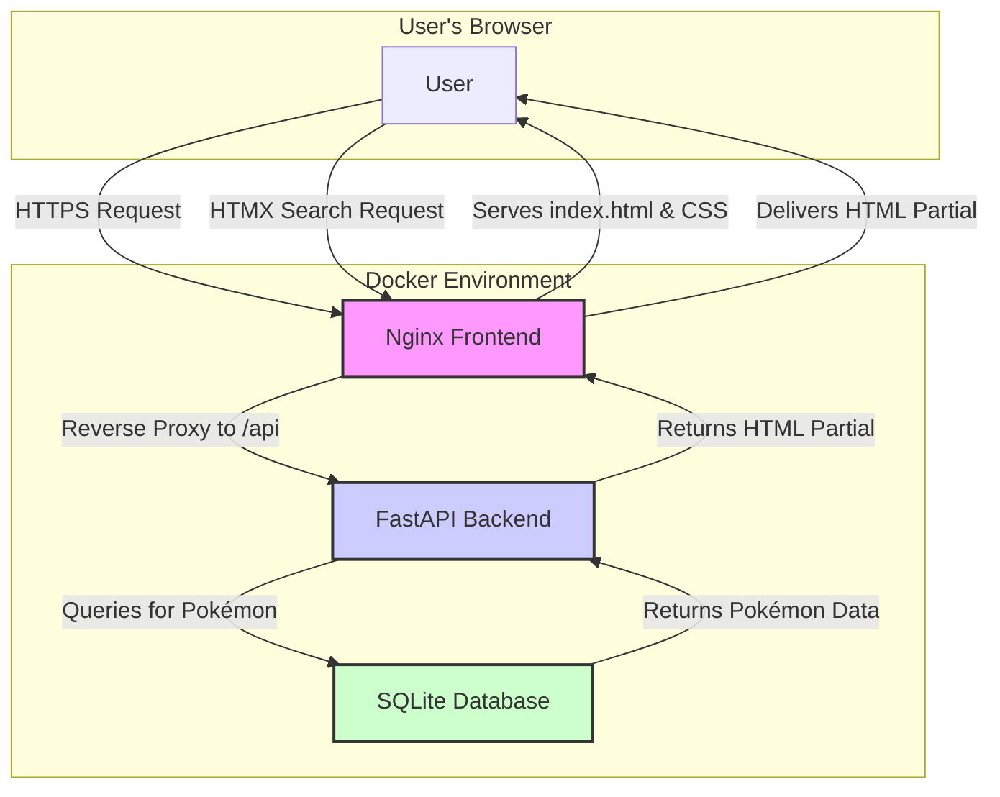
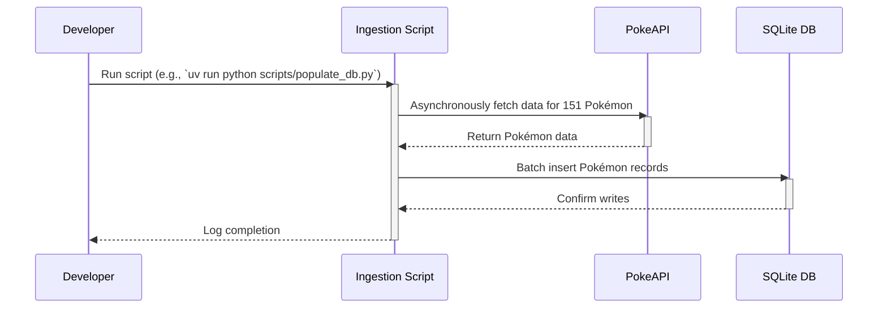

## 2. High-Level Architecture

The application will follow a classic **three-tier architecture**, containerized for portability and ease of deployment. This model provides a clear separation of concerns between presentation, application logic, and data storage.

#### 2.1. System Components

1.  **Frontend (Presentation Tier):** A static web interface built with HTML, Tailwind CSS, and HTMX. It will be served by an Nginx web server.
2.  **Backend (Application Tier):** A Python-based API built with FastAPI. This service will handle business logic, data processing, and communication with the database.
3.  **Database (Data Tier):** A simple SQLite database to store Pokémon data.

#### 2.2. Architecture Diagram

#### 2.3. Data Ingestion Flow

A one-time data ingestion script will populate the SQLite database from the public PokeAPI. This script is run manually once during setup or can be integrated into the container build process if needed.

