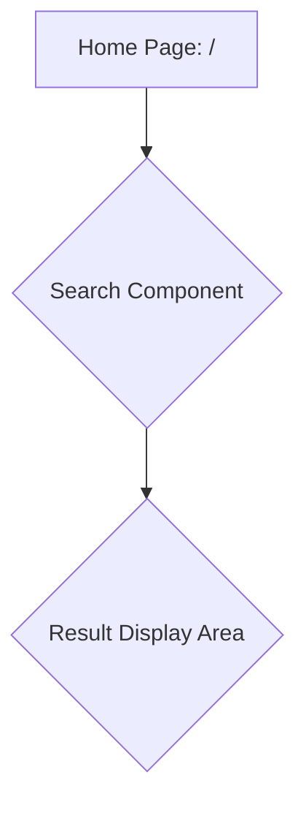
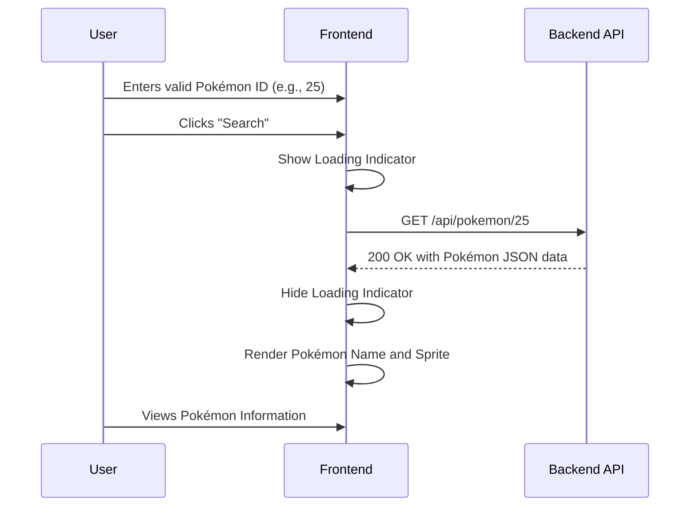
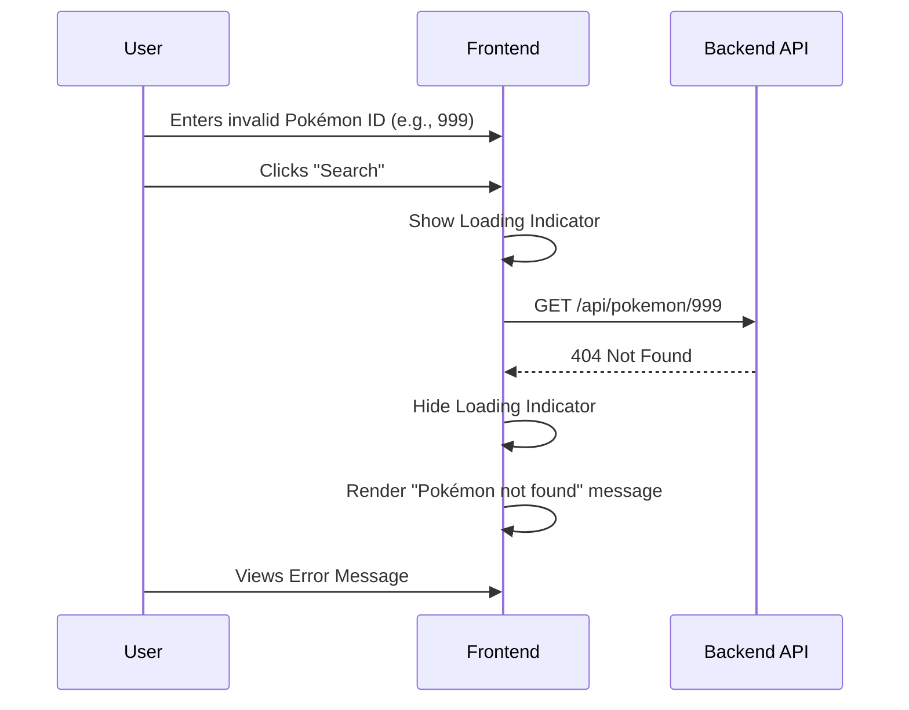

# Front-End Specification: Pokedex MVP

## 1. Introduction

This document outlines the front-end design, user experience (UX), and user interface (UI) requirements for the Pokedex MVP application. It translates the user-facing goals from the Product Requirements Document (PRD) into a concrete plan for the development agent. The primary goal is to create a minimalist, highly-responsive, and intuitive interface for searching and displaying Pokémon data, adhering strictly to the technical stack of HTMX and Tailwind CSS.

## 2. Overall UX Goals & Principles

This specification is guided by the UX vision in the PRD: "minimalist and utility-focused."

*   **Principle 1: Clarity Over Clutter:** The interface will be clean, with no extraneous visual elements. Every component on the screen will serve a direct purpose related to the search-and-display functionality.
*   **Principle 2: Immediate Feedback:** The user must always understand the application's state. The UI will provide instant visual cues for loading, success, and error conditions, preventing user confusion.
*   **Principle 3: Performance is a Feature:** The user experience is defined by speed. By using HTMX for partial page updates, we avoid full page reloads, making the application feel exceptionally fast and responsive, which is a key goal of the project showcase.
*   **Principle 4: Simplicity in Interaction:** The core user journey involves a single action: searching by ID. The design will optimize for this one path, making it as straightforward as possible.

## 3. Information Architecture

The application consists of a single page. The information architecture is therefore flat, containing only the essential components for the core user task.

**Site Map:**



*   **Home Page (`/`):** The single entry point and main view of the application.
*   **Search Component:** Contains the input field for the Pokémon ID and the search button.
*   **Result Display Area:** An initially empty container that will be dynamically populated with either the Pokémon data or an error message via an HTMX request.

## 4. User Flows

The application has two primary user flows originating from the search action.

### 4.1. Happy Path: Successful Search

The user enters a valid Pokémon ID and finds the corresponding Pokémon.



### 4.2. Error Path: Pokémon Not Found

The user enters an ID that does not exist in the database.



## 5. Wireframes & Mockups

These low-fidelity wireframes illustrate the layout and key UI components for the different states of the application. They are designed to be simple and directly translatable into HTML with Tailwind CSS classes.

### 5.1. Idle State

This is the default view of the application when the user first visits the page.

```mermaid
graph TD
    subgraph Pokedex Search Page
        direction TB
        A[Search Input: "Enter Pokémon ID..."]
        B[Search Button: "Search"]
        C(Result Area: Empty)

        A --> B
        B --> C
    end
```

### 5.2. Result State (Success)

This is the view after a successful search. The Result Area is populated with the fetched data.

```mermaid
graph TD
    subgraph Pokedex Search Page
        direction TB
        A[Search Input: "25"]
        B[Search Button: "Search"]
        subgraph Result Area
            direction TB
            D{Pokémon ID: 25}
            E{Name: Pikachu}
            F[Image: pikachu.png]
        end

        A --> B
        B --> Result Area
    end
```

## 6. Component States & Interactivity

The UI is composed of a single, stateful component: the search form and its result area. The interactivity is driven by HTMX attributes.

| Component Element | State | Trigger | Action / Visual Change | HTMX Implementation Notes |
| :--- | :--- | :--- | :--- | :--- |
| **Search Form** | Idle | Page Load | Input is empty, button is active, result area is empty. | N/A |
| | Client-Side Validation | User types non-numeric input | Browser prevents submission. | Use `<input type="number" min="1">`. |
| **Result Area** | Loading | `click` on Search Button | Display a loading spinner or text. | `htmx-indicator` class on a spinner element. |
| | Result (Success) | Successful API response | The `htmx-indicator` is hidden. The area is replaced with HTML containing the Pokémon's name and sprite. | `hx-get`, `hx-target`, `hx-swap="innerHTML"` on the form. |
| | Result (Error) | 404 API response | The `htmx-indicator` is hidden. The area is replaced with an error message (e.g., "Pokémon not found"). | Same as success, but backend returns the error message HTML partial. |

## 7. Accessibility & Responsiveness

This section ensures the application is usable by everyone and works across different devices, as required by the PRD.

*   **Responsive Design:** The layout must be fluid and adapt to both mobile and desktop screen sizes. A single-column layout will be used, with components stacking vertically on smaller screens. Tailwind CSS's responsive prefixes (e.g., `md:`, `lg:`) will be used to handle breakpoints.
*   **Keyboard Navigation:** All interactive elements (the input field and the search button) must be focusable and operable using the Tab and Enter keys.
*   **Semantic HTML:** Use appropriate HTML tags (e.g., `<main>`, `<form>`, `<label>`, `<input>`, `<button>`) to provide structural meaning. The search input will be explicitly linked to a `<label>` for screen readers.
*   **Color Contrast:** Text and interactive elements must have sufficient color contrast against their backgrounds to be easily readable, adhering to WCAG AA guidelines as a best practice.
*   **Image Alt Text:** The Pokémon sprite image will have descriptive `alt` text (e.g., "Sprite of Pikachu") for users of screen readers.
